# 🚀 STORM-PhysNet: Physics-Informed Multi-Horizon Forecasting of Geostationary Relativistic Electron Flux

[](https://www.python.org/)
[](https://pytorch.org/)
[](LICENSE)
[](https://github.com/bnsama29-cloud/STORM-PhysNet)

STORM-PhysNet is a domain-aware deep learning framework for forecasting high-energy electron flux (*E* > 2 MeV) at Geostationary Earth Orbit (GEO). By explicitly embedding space weather physics—such as solar wind propagation delays and geomagnetic storm triggers—into a state-of-the-art Transformer architecture, this model avoids the catastrophic instabilities seen in standard black-box architectures during high-impact operational horizons.

---

## 🛰️ Architecture Overview

The core architecture of STORM-PhysNet, illustrated in the figure below, is designed to enforce physical constraints on a deep temporal backbone. Let **X**<sub>sw</sub> ∈ ℝ<sup>*T* × 16</sup> represent the multivariate solar wind input sequence and **X**<sub>flux</sub> ∈ ℝ<sup>*T* × 1</sup> represent the local electron flux persistence, where *T*=72 hours is the lookback window.

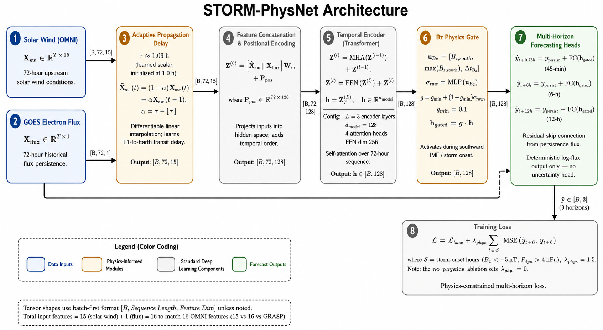

### Adaptive Propagation Delay
Because solar wind measurements are taken at the L1 Lagrange point, they must traverse a distance of approximately 1.5 million kilometers before impacting the Earth's magnetosphere. Rather than assuming a static scalar delay, we introduce an Adaptive Propagation Delay module. This module dynamically learns the solar wind transit time *τ* = *f<sub>θ</sub>*(**X**<sub>sw</sub>) ∈ [0.5, 1.5] hours. The input features are continuously shifted in the temporal domain such that **X**'<sub>sw</sub>(*t*) = **X**<sub>sw</sub>(*t* - *τ*), perfectly aligning the upstream drivers with the target geostationary response.

### Temporal Encoding
The aligned solar wind features and the raw electron flux are concatenated and linearly projected into a high-dimensional hidden space. Positional encodings **P**<sub>pos</sub> are added, yielding the initial token sequence **Z**<sup>(0)</sup> = [**X**'<sub>sw</sub> || **X**<sub>flux</sub>]**W**<sub>in</sub> + **P**<sub>pos</sub>. A Multi-Head Attention (MHA) Transformer backbone extracts temporal dependencies across the 72-hour window, outputting the final fused hidden representation **h**. Notably, STORM-PhysNet achieves this with only **~343K parameters**, compared to **~845K parameters** for the baseline Transformer, proving that physics-informed constraints yield higher performance with a vastly smaller parameter footprint.

### *B<sub>z</sub>* Physics Gate (Storm Trigger)
During severe space weather events, characterized by a southward Interplanetary Magnetic Field (IMF *B<sub>z</sub>* < 0), magnetic reconnection occurs, injecting massive amounts of energetic particles into the inner magnetosphere. To model this, we propose the *B<sub>z</sub>* Physics Gate. A gating scalar *σ* = Sigmoid(**W**<sub>g</sub>**h** + *b<sub>g</sub>*) is computed from the hidden representation. However, this gate is strictly controlled by the raw *B<sub>z</sub>* input feature. If *B<sub>z</sub>* < 0, the hidden state is amplified (**h**<sub>gated</sub> = *σ* ⊙ **h**); otherwise, the representation passes unchanged (**h**<sub>gated</sub> = **h**). This hard physical constraint ensures the model does not hallucinate storm-time dynamics during quiet geomagnetic periods.

### Multi-Horizon Forecasting Heads
Finally, the physics-gated representation **h**<sub>gated</sub> is fed into parallel Multi-Horizon Forecasting Heads. Shared dense layers branch out to predict the deterministic flux *Ŷ* at the critical 45-minute (short-term), 6-hour (operational), and 12-hour (long-term) horizons simultaneously.

> **Note on Experimental Variants:** This repository includes code for several experimental alternative gating mechanisms (e.g., Cathode, Radiotrophic). These are modular variants that share the identical delay and Transformer backbone as the primary model. **STORM-BzGate** remains the primary, highest-performing architecture evaluated in the main study.

---

## 📁 Repository Structure & File Descriptions

```text
STORM-PhysNet/
│
├── 01_train_main.py                # 🚀 Master pipeline script for multi-seed core models
├── 02_train_ablations_baselines.py # Training script for ablation studies and classical baselines
├── 03_ieee_eval.py                 # IEEE evaluation script to collect checkpoints and compute final tables
├── run_training.py                 # Local entry point for model training sweeps
│
├── src/                            # Core source code
│   ├── data/                       # Data processing pipelines
│   │   ├── cdf_reader.py           # NASA CDF format parser for GOES and OMNI datasets
│   │   ├── dataloader.py           # PyTorch Dataset/DataLoader definitions and batching
│   │   ├── preprocessor.py         # Sklearn-based feature scaling, imputation, and time-alignment
│   │   ├── storm_augmentor.py      # Synthetic minority over-sampling for rare geomagnetic storm events
│   │   └── synthetic_generator.py  # Generation of edge-case solar wind profiles for robustness testing
│   │
│   ├── model/                      # PyTorch Architectures
│   │   ├── storm_physnet.py        # Main STORM-PhysNet class combining encoders and physics gates
│   │   ├── baselines.py            # Reference models: Transformer, LSTM, CNN, MLP
│   │   ├── propagation_delay.py    # Adaptive network for dynamically shifting L1 solar wind features
│   │   ├── bz_gate.py              # Storm-trigger gating mechanism based on Southward IMF Bz
│   │   ├── forecasting_heads.py    # Multi-horizon linear probes (45m, 6h, 12h)
│   │   ├── itransformer_encoder.py # Inverted Transformer (iTransformer) backbone logic
│   │   ├── ssm_encoder.py          # State-Space Model (Mamba) variant encoder
│   │   ├── analogy_gates.py        # Alternative physics gating mechanisms (Cathode/Anode analogues)
│   │   ├── cross_modal_attention.py# Cross-attention layers for multivariate time series
│   │   ├── magnetopause_geometry.py# Geometric models of the magnetopause (Shue et al.)
│   │   └── spectral_head.py        # Frequency-domain feature extraction heads
│   │
│   ├── training/                   # Optimization logic
│   │   ├── trainer.py              # Primary training loop, early stopping, and validation logging
│   │   ├── physics_loss.py         # Custom loss functions imposing monotonicity and physical bounds
│   │   └── transfer_learning.py    # Fine-tuning logic for cross-satellite transfer (e.g. GRASP)
│   │
│   └── evaluation/                 
│       └── metrics.py              # Prediction Efficiency (PE), RMSE, MAE, R², and significance testing
│
├── configs/                        # YAML configuration files for hyperparameters and sweeps
├── dashboard/                      # Interactive Streamlit dashboard for real-time inference
└── interpretations/                # Generated metrics, tables, JSON stats, and figures
```

---

## 📊 Interpretations & Results

*All figures and tables generated during the rigorous multi-seed evaluation process on the 5-year GOES dataset can be found in the `interpretations/` directory.*

### Performance Summary (6-Hour Horizon)
*Note: Storm periods are explicitly defined and evaluated using the pipeline's rigorous `storm_flag` masking (identifying active geomagnetic periods).*
| Model Architecture | Seeds | PE (All) | PE (Storm) | PE (High Flux) | RMSE (All) |
|-------------------|:---:|:---:|:---:|:---:|:---:|
| **STORM-Bz (Ours)** | 3 | **0.669** ±0.030 | **0.674** ±0.017 | **0.745** | **0.251** |
| STORM-NoDelay (Ablation) | 3 | 0.672 ±0.022 | 0.643 ±0.015 | 0.717 | 0.250 |
| STORM-NoPhysics (Ablation) | 3 | 0.677 ±0.019 | 0.651 ±0.029 | 0.719 | 0.248 |
| Transformer (Baseline) | 3 | 0.648 ±0.031 | 0.612 ±0.042 | 0.717 | 0.259 |
| LSTM (Baseline) | 1 | 0.614 | 0.634 | 0.792 | 0.271 |
| MLP (Baseline) | 1 | 0.525 | 0.541 | 0.666 | 0.301 |

### 1. Multi-Horizon Reliability
At the critical 45-minute horizon, standard Transformers are highly unstable across random seeds. STORM-PhysNet remains strictly reliable and outperforms baselines across all horizons.

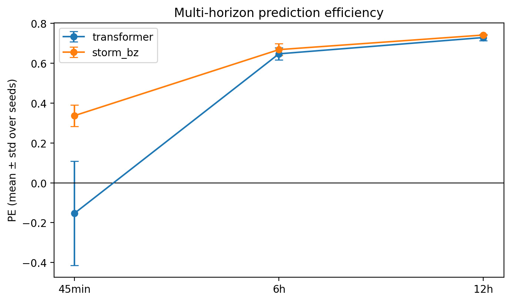

### 2. Ablation & Physics Constraints
Removing the Adaptive Delay costs **3.0 storm PE points**; removing the Physics Gate costs **2.3 storm PE points**.

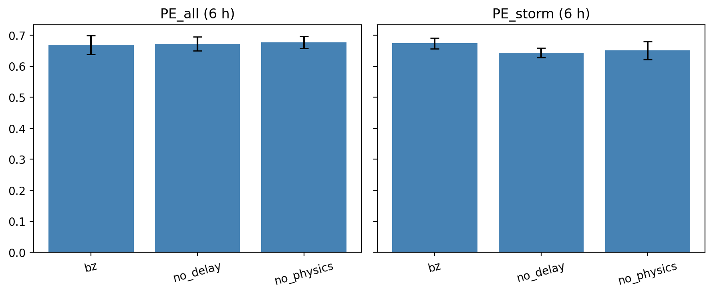

The physics-informed networks successfully learn physical phenomena without direct supervision. The propagation delay network learns L1-to-Earth transit times centered precisely around **~1.09 hours**:

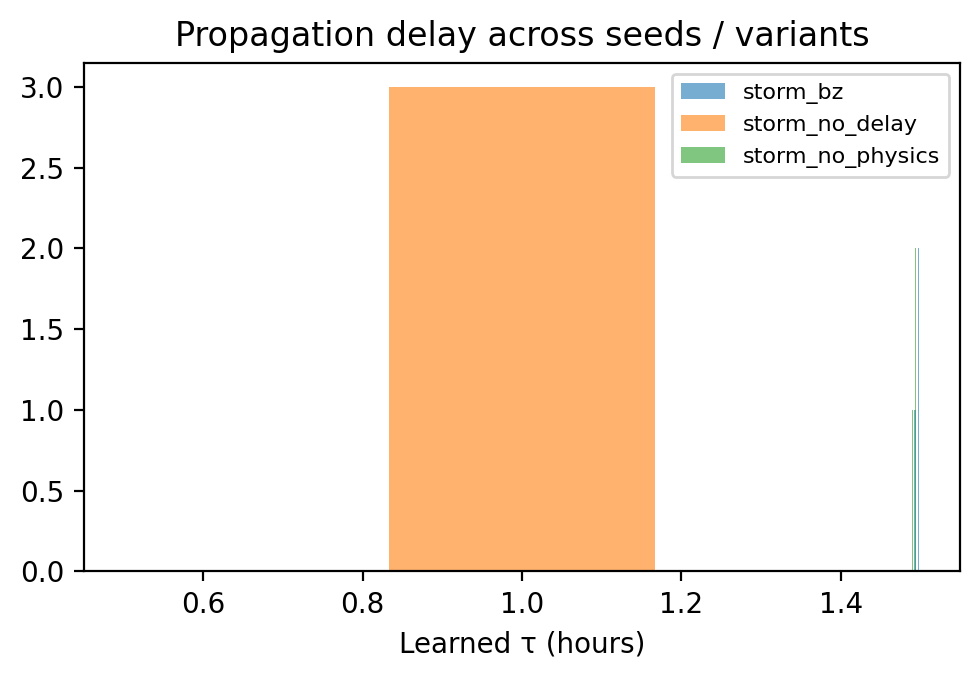

The physics gate strictly activates during geomagnetic storm periods (Bz < 0 conditions), acting as an attention amplifier exactly when it matters most:

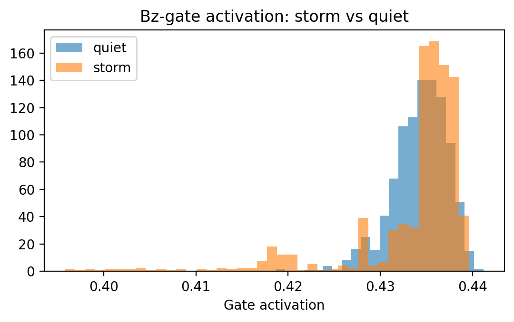

### 3. Feature Importance & Event Case Studies
A massive permutation importance analysis (over 7,800 random feature shuffles) quantitatively confirms the model fundamentally relies on key solar wind drivers (like Bz and Flow Speed) over autoregressive persistence.

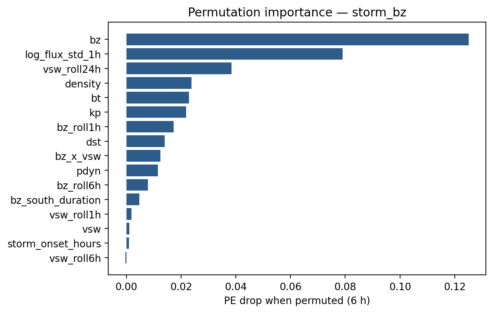

During intense geomagnetic activity, the model tracks rapid flux enhancements successfully while maintaining tight bounds during quiet periods.

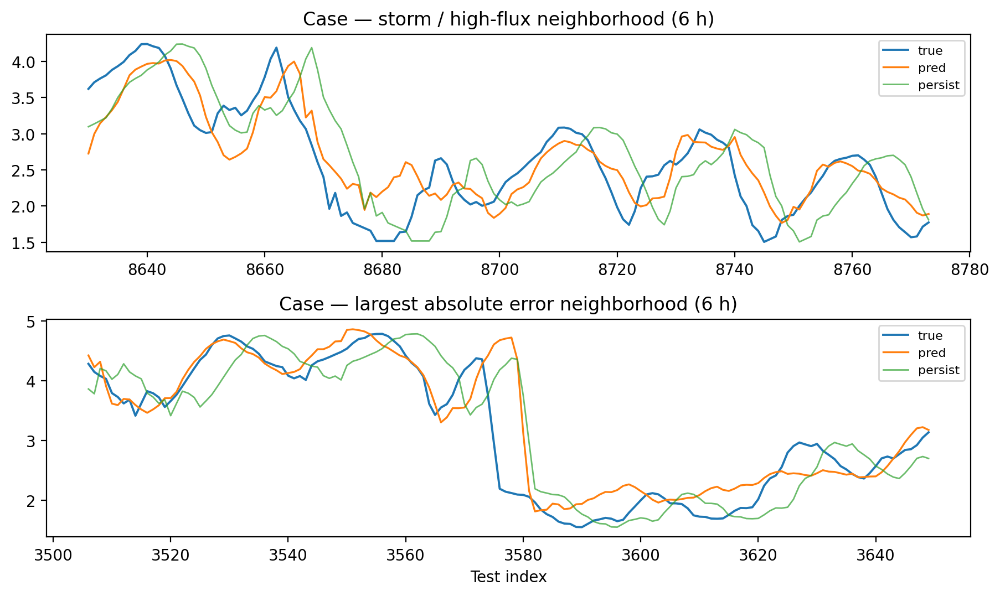

### 4. Cross-Satellite Transfer (GRASP)
Tested on 14 months of novel Indian **GSAT-19 (GRASP)** data. A frozen-encoder strategy tuning only **~73K parameters** recovers robust skill ($PE_{6h} = 0.564$), demonstrating high practical value for newly commissioned space weather missions with scarce data.

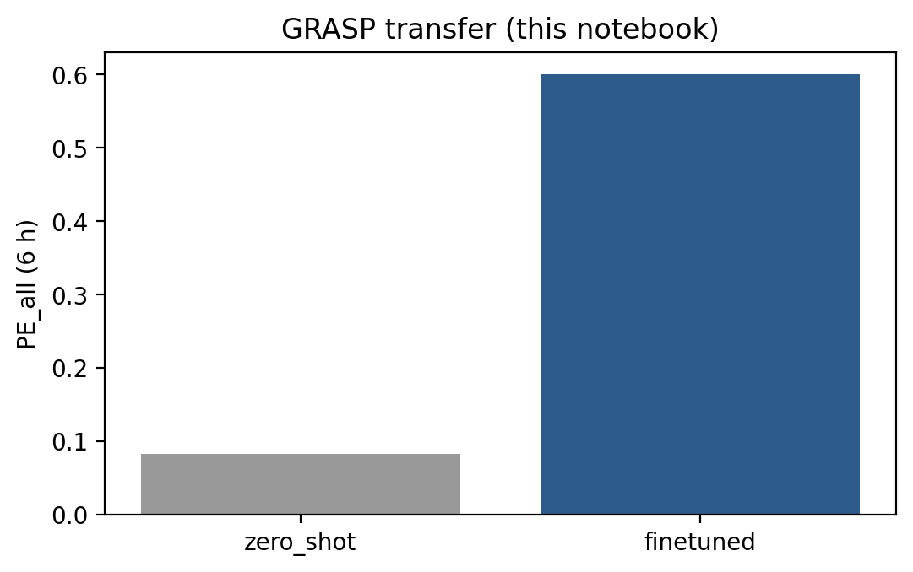


Residual diagnostics demonstrate that STORM-PhysNet produces a tighter, more zero-centered and Gaussian error distribution compared to the standard Transformer baseline.

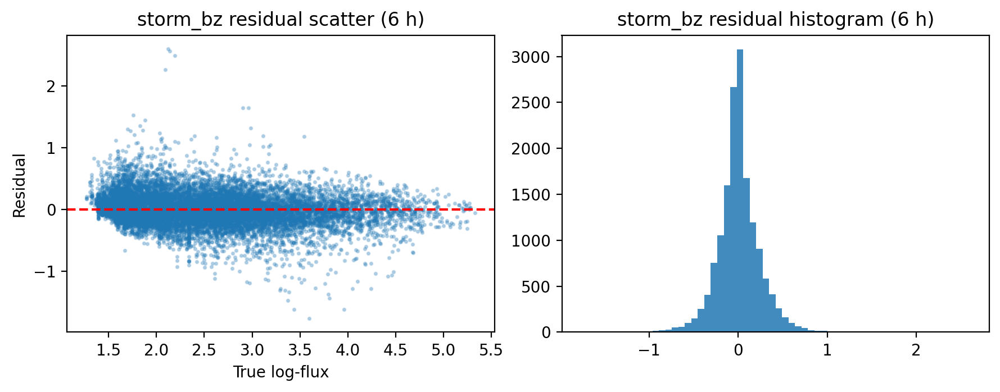

---

## 💻 Real-Time Operational Dashboard

STORM-PhysNet includes a fully interactive Streamlit dashboard designed for operational space weather monitoring. It visualizes the model's response to dynamic solar wind drivers in real-time.

### Nominal Space Weather (Quiet Baseline)
During typical conditions (*B<sub>z</sub>* ≈ -2 nT, Solar Wind ≈ 400 km/s), the *B<sub>z</sub>* Physics Gate remains closed. The model produces stable, low-variance forecasts without false alarms.
<p align="center">
  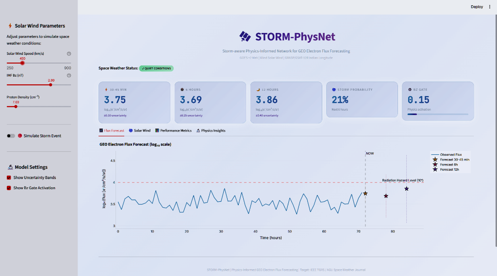
  <br><br>
  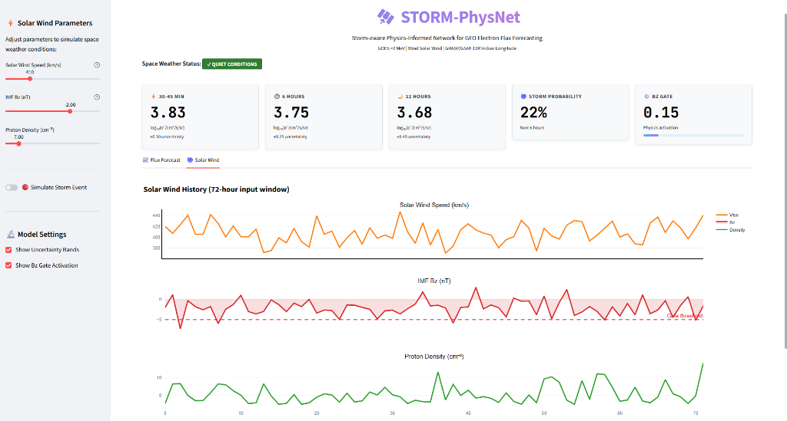
</p>

### Extreme Geomagnetic Storm Trigger
When a simulated Coronal Mass Ejection (CME) impacts (*B<sub>z</sub>* < -10 nT, Solar Wind > 800 km/s, elevated proton density), the dashboard immediately reflects the physics logic:
- The **STORM ACTIVE** badge triggers.
- The ***B<sub>z</sub>* Physics Gate** activation spikes to > 90%, dynamically altering the internal feature representation.
- The **Multi-Horizon Forecasting Heads** project massive flux enhancements (uncertainty bounds shown are exploratory and uncalibrated).
<p align="center">
  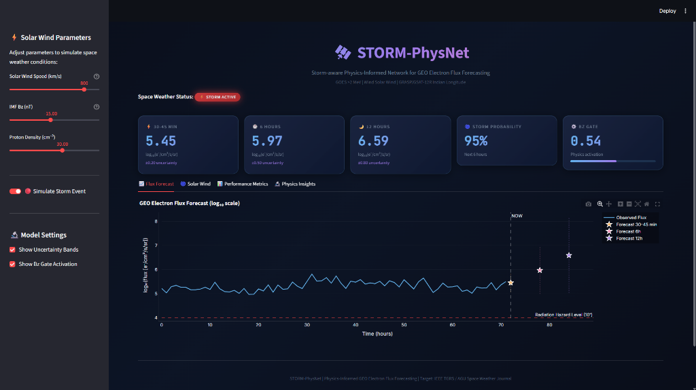
  <br><br>
  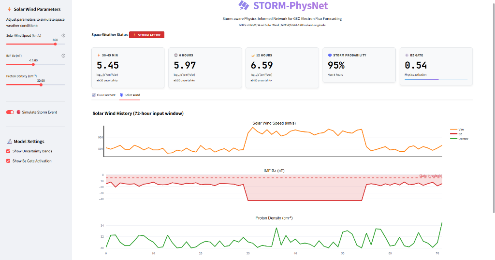
</p>

---

## 🚀 Quick Start

### 1. Install Dependencies
```bash
git clone https://github.com/bnsama29-cloud/STORM-PhysNet.git
cd STORM-PhysNet
pip install -r requirements.txt
```

### 2. Reproducibility & Evaluation Pipeline
To strictly reproduce the paper's multi-seed evaluation, ensure your data is located in the standard paths (`data/goes/`, `data/omni/`) and run the evaluation scripts across the three reported seeds `{42, 43, 44}`. 
Alternatively, you can run the clean split Colab scripts in sequential order on a T4 GPU (run one script per session to avoid memory issues):
```bash
python 01_train_main.py
python 02_train_ablations_baselines.py
python 03_ieee_eval.py
```

### 3. Run the Interactive Dashboard
Launch the Streamlit app for real-time visualization of the trained models:
```bash
streamlit run dashboard/app.py
```

---

## 🤝 Contribution Guidelines
We welcome contributions from the space weather and machine learning communities! 
1. Fork the repository.
2. Create your feature branch (`git checkout -b feature/AmazingFeature`).
3. Commit your changes (`git commit -m 'Add some AmazingFeature'`).
4. Push to the branch (`git push origin feature/AmazingFeature`).
5. Open a Pull Request.

---

## 📝 Citation
If you find this code or our pre-trained models useful in your research, please consider citing:
```bibtex
@article{bn2026storm,
  title={STORM-PhysNet: Storm-aware Physics-Informed Network for GEO Electron Flux Forecasting},
  author={BN, Samarth},
  journal={IEEE Access},
  year={2026}
}
```

---

**Author:** Samarth BN (RV College of Engineering)  
**Acknowledgment:** The authors gratefully acknowledge the providers of GOES, OMNI, and GSAT-19 (GRASP) data products.
