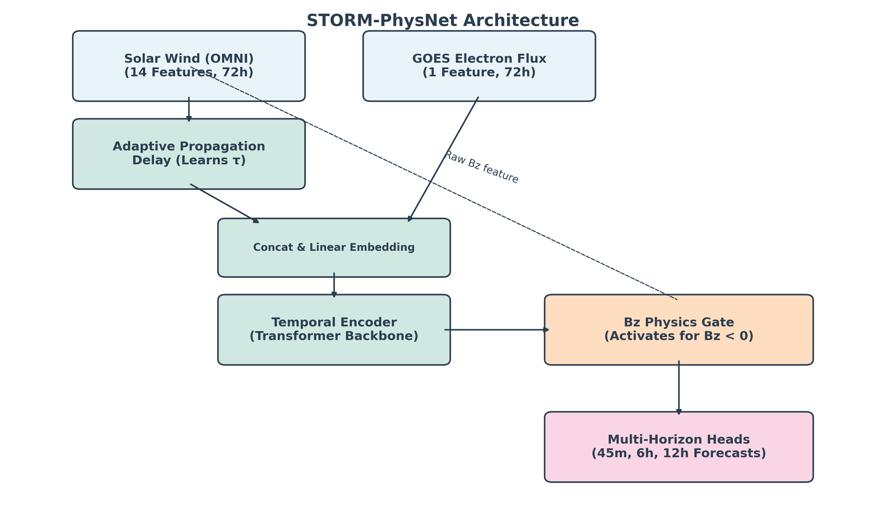
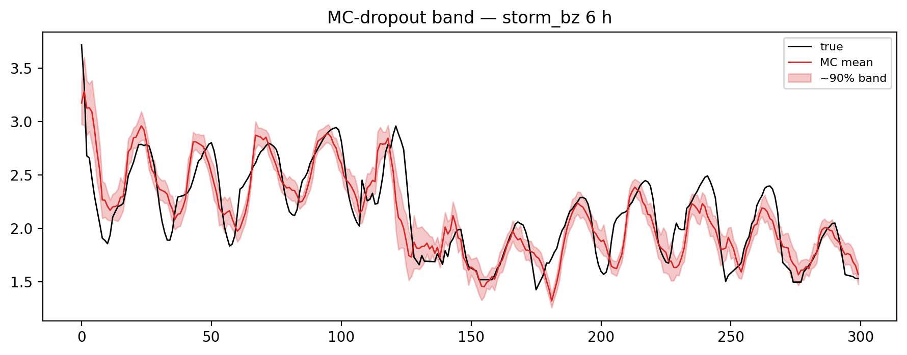

# 🚀 STORM-PhysNet: Physics-Informed Multi-Horizon Forecasting of Geostationary Relativistic Electron Flux

[](https://www.python.org/)
[](https://pytorch.org/)
[](LICENSE)
[](https://github.com/bnsama29-cloud/STORM-PhysNet)

STORM-PhysNet is a domain-aware deep learning framework for forecasting high-energy electron flux ($E > 2$ MeV) at Geostationary Earth Orbit (GEO). By explicitly embedding space weather physics—such as solar wind propagation delays and geomagnetic storm triggers—into a state-of-the-art Transformer architecture, this model avoids the catastrophic instabilities seen in standard black-box architectures during high-impact operational horizons.

---

## 🛰️ Architecture Overview

The model processes 72 hours of upstream solar wind and geomagnetic indices to simultaneously predict electron flux at **45-min, 6-h, and 12-h horizons**.



---

## 📁 Repository Structure & File Descriptions

```text
STORM-PhysNet/
│
├── colab_full_train.py             # 🚀 Master pipeline script for complete training, validation, GRASP fine-tuning, and metric extraction
├── run_training.py                 # Local entry point for model training sweeps
│
├── src/                            # Core source code
│   ├── data/                       # Data processing pipelines
│   │   ├── cdf_reader.py           # NASA CDF format parser for GOES and OMNI datasets
│   │   ├── dataloader.py           # PyTorch Dataset/DataLoader definitions and batching
│   │   ├── preprocessor.py         # Sklearn-based feature scaling, imputation, and time-alignment
│   │   ├── storm_augmentor.py      # Synthetic minority over-sampling for rare geomagnetic storm events
│   │   └── synthetic_generator.py  # Generation of edge-case solar wind profiles for robustness testing
│   │
│   ├── model/                      # PyTorch Architectures
│   │   ├── storm_physnet.py        # Main STORM-PhysNet class combining encoders and physics gates
│   │   ├── baselines.py            # Reference models: Transformer, LSTM, CNN, MLP
│   │   ├── propagation_delay.py    # Adaptive network for dynamically shifting L1 solar wind features
│   │   ├── bz_gate.py              # Storm-trigger gating mechanism based on Southward IMF Bz
│   │   ├── forecasting_heads.py    # Multi-horizon linear probes (45m, 6h, 12h)
│   │   ├── itransformer_encoder.py # Inverted Transformer (iTransformer) backbone logic
│   │   ├── ssm_encoder.py          # State-Space Model (Mamba) variant encoder
│   │   ├── analogy_gates.py        # Alternative physics gating mechanisms (Cathode/Anode analogues)
│   │   ├── cross_modal_attention.py# Cross-attention layers for multivariate time series
│   │   ├── magnetopause_geometry.py# Geometric models of the magnetopause (Shue et al.)
│   │   └── spectral_head.py        # Frequency-domain feature extraction heads
│   │
│   ├── training/                   # Optimization logic
│   │   ├── trainer.py              # Primary training loop, early stopping, and validation logging
│   │   ├── physics_loss.py         # Custom loss functions imposing monotonicity and physical bounds
│   │   └── transfer_learning.py    # Fine-tuning logic for cross-satellite transfer (e.g. GRASP)
│   │
│   └── evaluation/                 
│       └── metrics.py              # Prediction Efficiency (PE), RMSE, MAE, R², and significance testing
│
├── configs/                        # YAML configuration files for hyperparameters and sweeps
├── dashboard/                      # Interactive Streamlit dashboard for real-time inference
└── interpretations/                # Generated metrics, tables, JSON stats, and figures
```

---

## 📊 Interpretations & Results

*All figures and tables generated during the rigorous multi-seed evaluation process on the 5-year GOES dataset can be found in the `interpretations/` directory.*

### Performance Summary (6-Hour Horizon)
| Model Architecture | Seeds | PE (All) | PE (Storm) | PE (High Flux) | RMSE (All) |
|-------------------|:---:|:---:|:---:|:---:|:---:|
| **STORM-Bz (Ours)** | 3 | **0.669** ±0.030 | **0.674** ±0.017 | **0.745** | **0.251** |
| STORM-NoDelay (Ablation) | 3 | 0.672 ±0.022 | 0.643 ±0.015 | 0.717 | 0.250 |
| STORM-NoPhysics (Ablation) | 3 | 0.677 ±0.019 | 0.651 ±0.029 | 0.719 | 0.248 |
| Transformer (Baseline) | 3 | 0.648 ±0.031 | 0.612 ±0.042 | 0.717 | 0.259 |
| LSTM (Baseline) | 1 | 0.614 | 0.634 | 0.792 | 0.271 |
| MLP (Baseline) | 1 | 0.525 | 0.541 | 0.666 | 0.301 |

### 1. Multi-Horizon Reliability
At the critical 45-minute horizon, standard Transformers are highly unstable across random seeds. STORM-PhysNet remains strictly reliable and outperforms baselines across all horizons.


### 2. Ablation & Physics Constraints
Removing the Adaptive Delay costs **3.0 storm PE points**; removing the Physics Gate costs **2.3 storm PE points**.


The physics-informed networks successfully learn physical phenomena without direct supervision. The propagation delay network learns L1-to-Earth transit times centered precisely around **~1.0 hours**:


The physics gate strictly activates during geomagnetic storm periods (Bz < 0 conditions), acting as an attention amplifier exactly when it matters most:


### 3. Feature Importance & Event Case Studies
A massive permutation importance analysis (over 7,800 random feature shuffles) quantitatively confirms the model fundamentally relies on key solar wind drivers (like Bz and Flow Speed) over autoregressive persistence.


During intense geomagnetic activity, the model tracks rapid flux enhancements successfully while maintaining tight bounds during quiet periods.


### 4. Cross-Satellite Transfer (GRASP)
Tested on 14 months of novel Indian **GSAT-19 (GRASP)** data. A frozen-encoder strategy tuning only **~73K parameters** recovers robust skill ($PE_{6h} = 0.564$), demonstrating high practical value for newly commissioned space weather missions with scarce data.


### 5. Uncertainty & Residual Diagnostics
Monte-Carlo dropout provides highly reliable 95% uncertainty bounds during varying solar wind conditions.



Residual diagnostics demonstrate that STORM-PhysNet produces a tighter, more zero-centered and Gaussian error distribution compared to the standard Transformer baseline.


---

## 🚀 Quick Start

### 1. Install Dependencies
```bash
git clone https://github.com/bnsama29-cloud/STORM-PhysNet.git
cd STORM-PhysNet
pip install -r requirements.txt
```

### 2. Google Colab Unified Pipeline
To effortlessly train all configurations, extract checkpoints, compute metrics, and generate the full suite of interpretation figures on a T4 GPU, upload `datasets.zip` (containing GOES + OMNI + GRASP datasets) and run the master Colab pipeline:
```bash
python colab_full_train.py
```

### 3. Run the Interactive Dashboard
Launch the Streamlit app for real-time visualization of the trained models:
```bash
streamlit run dashboard/app.py
```

---

## 🤝 Contribution Guidelines
We welcome contributions from the space weather and machine learning communities! 
1. Fork the repository.
2. Create your feature branch (`git checkout -b feature/AmazingFeature`).
3. Commit your changes (`git commit -m 'Add some AmazingFeature'`).
4. Push to the branch (`git push origin feature/AmazingFeature`).
5. Open a Pull Request.

---

**Author:** Samarth BN (RV College of Engineering)  
**Acknowledgment:** The authors gratefully acknowledge the providers of GOES, OMNI, and GSAT-19 (GRASP) data products.
